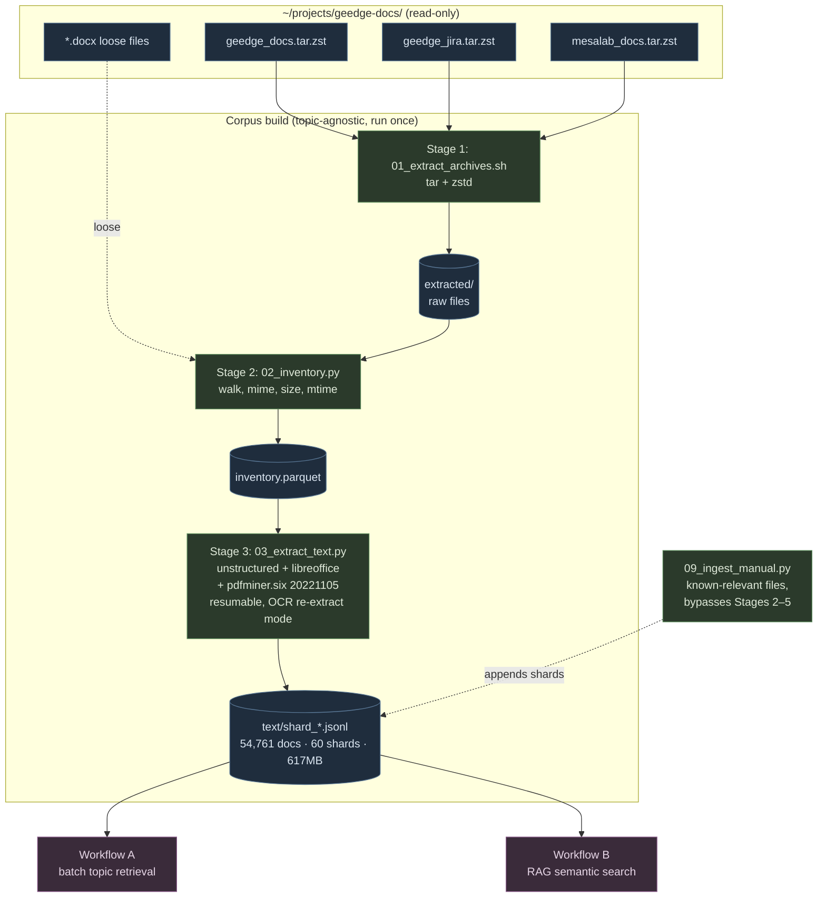
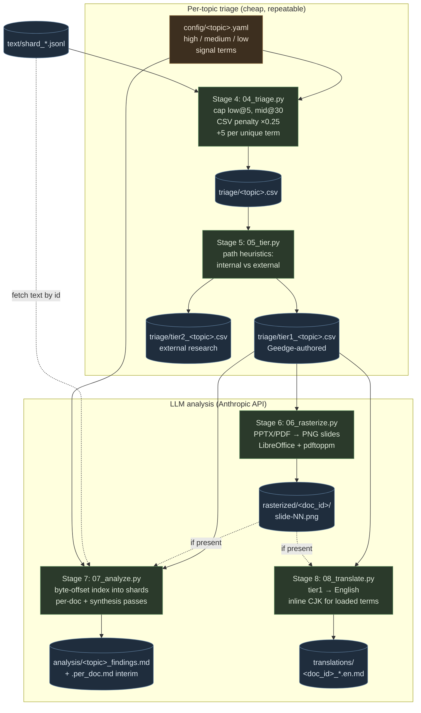
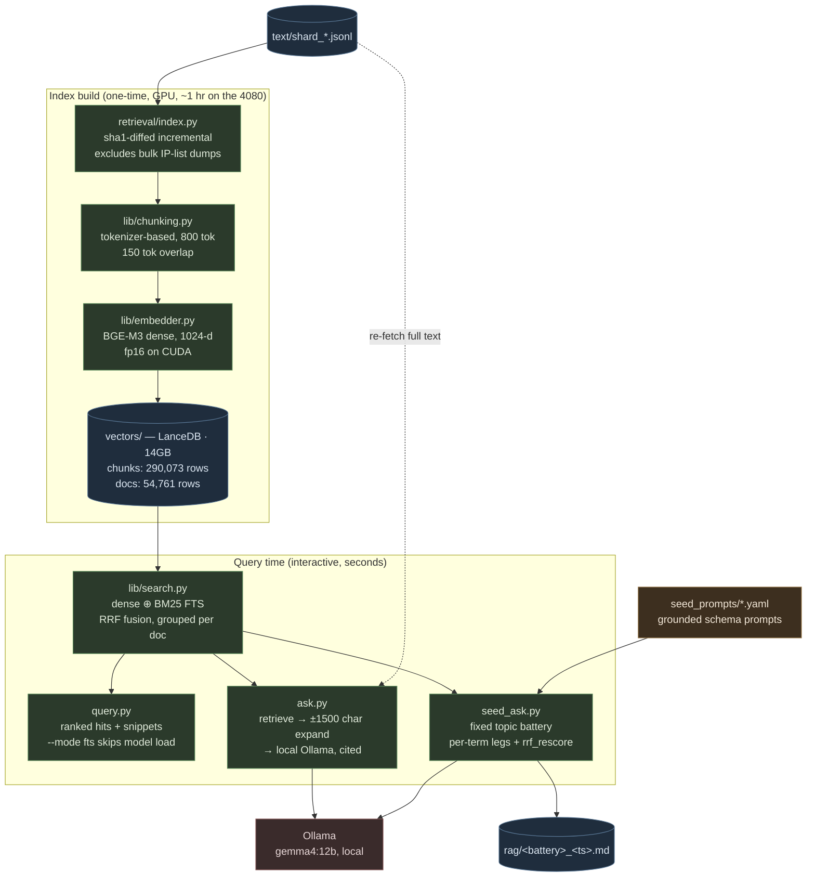

# Note: Written with Claude, judgments/QA, and debugging are my own - Justin

# Geedge Leak RAG Pipeline

A staged, local-first pipeline for analyzing the Geedge / MESA Lab document leak
(~600GB total, ~100GB of human-written documents). Designed for ranked retrieval
on a topic — first target is **DNS4CN**.

## Threat model & OPSEC

The leak materials are flagged as potentially containing malware. Native parsers
used here (LibreOffice, poppler, exiftool) have a CVE history on malformed input.

- Run inside a dedicated WSL2 distro reserved for this project.
- Keep the source directory (`~/projects/geedge-docs/`) read-only (`chmod -R a-w`).
- No outbound network except `api.anthropic.com` and `huggingface.co` (model downloads).
- Verify the torrent hash before trusting any file.

## One-time setup

### Windows side

1. Update NVIDIA driver to ≥ 555.x (CUDA on WSL needs this).
2. `wsl --install -d Ubuntu-24.04` (or use an existing distro you don't mind dedicating).
3. Confirm `nvidia-smi` works *inside* WSL — should show the RTX 4080.

### Inside WSL

```bash
# System deps for unstructured / Tika fallback
sudo apt update && sudo apt install -y \
  build-essential python3.11-venv python3-pip \
  ripgrep zstd p7zip-full unar \
  poppler-utils tesseract-ocr libreoffice \
  libmagic1 libgl1

# Project setup
cd ~ && git clone <this-repo> geedge-rag && cd geedge-rag
python3.11 -m venv .venv
source .venv/bin/activate
pip install --upgrade pip
pip install -r requirements.txt

# Verify torch sees the GPU
python -c "import torch; print(torch.cuda.is_available(), torch.cuda.get_device_name(0))"
```

### Data layout

Source files live on the WSL ext4 filesystem at `~/projects/geedge-docs/`
(flat directory — archives and loose docs at the same level). Working output
goes to a separate `~/geedge-data/` directory.

```text
~/projects/geedge-docs/         # read-only source (WSL ext4)
├── geedge_docs.tar.zst
├── geedge_jira.tar.zst
├── mesalab_docs.tar.zst
└── *.docx                      # loose files at root

~/geedge-data/                  # working dir on WSL ext4 (~129GB)
├── extracted/                  # output of 01_extract_archives.sh (65GB)
├── inventory.parquet           # output of 02_inventory.py
├── text/                       # JSONL shards from 03_extract_text.py (617MB)
├── triage/                     # ranked CSVs from 04_triage.py / 05_tier.py
├── rasterized/                 # slide PNGs from 06_rasterize.py
├── vectors/                    # LanceDB index from retrieval/index.py (14GB)
└── rag/                        # reports from retrieval/seed_ask.py
```

Everything under `~/geedge-data/` derives from `$GEEDGE_WORK`, so the working
tree relocates by changing one environment variable. Of it, only `text/`
(617MB) is expensive to recreate — see [docs/portability.md](docs/portability.md)
before moving or backing up any of this.

## Pipeline

| Stage | Script | Time (est) | Output |
| ----- | ------ | ---------- | ------ |
| 1 | `01_extract_archives.sh` | 1–2 hr | `extracted/` |
| 2 | `02_inventory.py` | 20–40 min | `inventory.parquet` |
| 3 | `03_extract_text.py` | 8–24 hr | `text/*.jsonl` |
| 4 | `04_triage.py --topic <name>` | ~1 min | `triage/<name>.csv` |
| 5 | `05_tier.py --topic <name>` | instant | `triage/tier{1,2}_<name>.csv` |
| 6 | `06_rasterize.py --tier-csv <tier1 csv>` | minutes | `rasterized/<doc_id>/slide-NN.png` |
| 7 | `07_analyze.py --tier-csv <tier1 csv>` | minutes | `analysis/<name>_findings.md` |
| 8 | `08_translate.py --tier-csv <tier1 csv>` | minutes | `translations/<doc_id>_*.en.md` |
| 9 | `09_ingest_manual.py --topic <name>` | seconds–minutes | `triage/manual_<name>.csv` (bypasses Stages 2–5) |

Stages 1–3 are topic-agnostic and run once over the whole corpus. Stages 4 → 5 → 6 → 7
re-run per topic and only need a new `config/<topic>.yaml`. Stage 6 (rasterize) is
optional but recommended before Stage 7 if tier1 contains slide decks — Stage 7 will
pick up rasterized images automatically if present. Stage 8 (translate) and Stage 9
(manual ingest) are independent utilities, not required in the main line.

Semantic search is **not** a numbered stage. It lives in a parallel subsystem,
[`retrieval/`](retrieval/), which reads the same Stage 3 JSONL shards and is
described under [Workflow B](#workflow-b--rag-corpus-wide-semantic-search) below.
Keyword triage remained sufficient for named targets like DNS4CN; `retrieval/`
exists for the fuzzier questions triage can't express — ones whose vocabulary
never appears literally in the corpus.

For a named project (like DNS4CN), keyword triage is enough. Stage 4 originally used raw weighted keyword
scoring (10/3/1 points per high/medium/low-signal term occurrence, uncapped),
but that let bulk data dumps drown out real analysis — a spreadsheet with
"DNS"×13,000 would outscore a document that thoughtfully discussed DNS4CN a
dozen times. Stage 4 now caps low-signal term counts, penalizes bulk data
files, and rewards term diversity so analytic documents rise above CSV dumps.
(This used to be a separate `04b_triage.py` variant; it was folded into Stage 4
directly since it strictly improved on the original and fixed a `high_hits`
counting bug in it — see git history if you need the old raw-scoring script.)

## Architecture

Two workflows sit on top of one shared corpus build. They answer different
questions, share no code, and are joined only by the Stage 3 JSONL shards:

| | **Workflow A** — batch topic retrieval | **Workflow B** — RAG semantic search |
| --- | --- | --- |
| Lives in | `scripts/` (Stages 1–9) | `retrieval/` (no stage numbers) |
| Answers | "rank every doc against *this* topic" | "what does the corpus say about X?" |
| Driven by | `config/<topic>.yaml` term lists | ad-hoc query string |
| Matching | weighted keyword + path heuristics | BGE-M3 dense + BM25, RRF-fused |
| Cost model | batch, hours, Anthropic API spend | interactive, seconds, local Ollama |
| Output | ranked CSVs → `analysis/*_findings.md` | terminal hits / cited answers / `rag/*.md` |
| Needs a GPU? | no | yes, for the one-time index build |

Pick A when you can enumerate the vocabulary up front and want *exhaustive
ranked coverage* of a named target. Pick B when you can't — when the phrasing
you'd search for may never literally appear.

### Shared corpus build



The shards are the **only** contract between the two workflows — no imports run
in either direction. Anything downstream of them is rebuildable and disposable.

### Workflow A — batch topic retrieval (`scripts/`)

Given a topic's vocabulary, score and rank the entire corpus, cut it down to the
internal documents, and spend LLM budget only on those.



### Workflow B — RAG (corpus-wide semantic search)

Embed every shard once, then query interactively. Built this week; see
[`retrieval/README.md`](retrieval/README.md) for the full CLI surface.



Two properties worth noting, both deliberate: the index is **disposable** —
rebuildable from the shards at any time, which is what makes the whole tree
portable — and the answer layer is **local-only** (Ollama), so unlike Workflow
A's Stage 7 it costs nothing per query and sends no corpus text off the box.

### Stage details

**Stage 4 (`04_triage.py`)** — weighted keyword scoring against `config/<topic>.yaml`,
with three noise-reduction filters so analytic documents outrank bulk data dumps:

- Per-tier occurrence caps: `--low-cap 5`, `--mid-cap 30` (high-signal terms uncapped)
- Data-file penalty: `.csv` / `.xls` / `.xlsx` with 0 high-signal hits × `--data-penalty` (0.25)
- Diversity bonus: `+--div-bonus` (5) points per unique term matched

Effect: a spreadsheet with `DNS×13,948` drops from score 13,948 → ~1.5, while a
PPTX matching `DNS4CN + 盾立方 + DoH + resolver` gets a diversity boost. (An
earlier raw-scoring version without these filters let bulk data dumps drown out
real analysis; it's gone now, folded into this stage.)

**Stage 5 (`05_tier.py`)** — splits the triage CSV before any API spend:

- `tier1`: `high_hits > 0` **OR** (path is in `study/` / `MeshTrust/` / `YYDNS/` non-attachments **AND** filename contains CJK) → internal Geedge/MESA docs
- `tier2`: everything else (mostly external research papers Geedge was *reading*, not authoring)

The scoring in Stage 4 alone can't tell "Geedge built this" from "Geedge had a
copy of this" — both hit DNS/DoH/DoT heavily. Stage 5 makes that cut via path
heuristics so Stage 7 only spends tokens on internal documents.

**Stage 6 (`06_rasterize.py`)** — slide decks (and, with `--include-pdf`, PDFs)
carry content in diagrams and image-embedded text that text-only extraction
(Stage 3) misses entirely. Converts PPTX → PDF via headless LibreOffice, then
renders each page to PNG via `pdftoppm`. Optional but recommended before
Stage 7 whenever tier1 contains slide decks — a no-op re-run for
already-rasterized docs.

**Stage 7 (`07_analyze.py`)** — sends each tier-1 doc to Claude with prompt
caching on the long system prompt, then runs a synthesis pass over all per-doc
outputs. Builds a byte-offset index `{id → (shard, offset)}` up front so it
seeks into shards instead of rescanning. Per-doc payload capped at 80k chars.
Attaches Stage 6's rasterized PNGs as vision blocks when present. Both passes
default to `claude-opus-4-7` (`--per-doc-model` / `--synthesis-model` to
override); the DNS4CN run came in around $15 against a $100 ceiling.

**Stage 8 (`08_translate.py`)** — independent utility, not required in the
main pipeline: produces readable English translations of tier-1 docs (with
inline CJK for loaded terms), attaching rasterized slide images for PPTX/PPT
the same way Stage 7 does.

**Stage 9 (`09_ingest_manual.py`)** — independent utility for files placed in
`extracted/_manual_additions/` that are already known to be relevant. Bypasses
Stages 2–5 entirely: computes the same stable IDs as Stage 2, extracts text
like Stage 3, and appends directly to the JSONL shards and a
`triage/manual_<topic>.csv` so Stages 6–7 pick them up like any other tier1 doc.

### Repurposing for a new topic

See [docs/new-topic.md](docs/new-topic.md) for a step-by-step guide. The short
version: Stages 1–3 are topic-agnostic (verified by grep — no topic terms
anywhere in those scripts), so adding a new research topic only requires a
new `config/<topic>.yaml` and re-running Stages 4 → 5 → 6 → 7.

## Run order

```bash
# Set the source path once
export GEEDGE_RAW=~/projects/geedge-docs
export GEEDGE_WORK=~/geedge-data
mkdir -p $GEEDGE_WORK

# Stage 1: extract archives (skips repo.tar and mesalab_git.tar.zst)
bash scripts/01_extract_archives.sh

# Stage 2: inventory
python scripts/02_inventory.py

# Stage 3: extract text (resumable; safe to re-run)
python scripts/03_extract_text.py --workers 12

# Stage 4: keyword triage for DNS4CN
python scripts/04_triage.py --topic dns4cn

# Stage 5: split into internal (tier1) vs external (tier2)
python scripts/05_tier.py --topic dns4cn

# Stage 6: rasterize tier1 slide decks for vision analysis (optional but recommended)
python scripts/06_rasterize.py --tier-csv ~/geedge-data/triage/tier1_dns4cn.csv

# Stage 7: analyze tier1 docs with Claude (spends API budget — dry-run first)
export ANTHROPIC_API_KEY=sk-...
python scripts/07_analyze.py --tier-csv ~/geedge-data/triage/tier1_dns4cn.csv \
    --topic dns4cn --out ~/geedge-data/analysis/dns4cn_findings.md --dry-run
```

### Workflow B (`retrieval/`)

Independent of the stage numbering above — it needs only Stage 3's shards.
Full CLI reference in [retrieval/README.md](retrieval/README.md).

```bash
# One-time: build the index (GPU; ~1 hr on the 4080). Dry-run touches no GPU.
python -m retrieval.index --dry-run
python -m retrieval.index

# Ranked hits. --mode fts skips the model load entirely — best for identifiers.
python -m retrieval.query "XDC02030000" --mode fts
python -m retrieval.query "域名劫持 检测" --jira

# Cited answers from a local model (needs Ollama running — no API spend)
python -m retrieval.ask "What is DNS4CN?"

# The fixed topic battery → $GEEDGE_WORK/rag/<battery>_<timestamp>.md
python -m retrieval.seed_ask --topic dns4cn
```

Re-running `python -m retrieval.index` after a `03 --reextract-low-text` or
`09_ingest_manual.py` run is incremental (sha1-diffed) — no `--rebuild` needed.

## Notes

- **Resumability**: stage 3 writes one JSONL shard per 1000 files and skips
  files already processed. Crashes are cheap.
- **Language**: detected per-document via `langdetect`. Both zh and en chunks
  flow through the same pipeline; BGE-M3 handles cross-lingual at search time.
- **Source-code archives are skipped intentionally**. DNS4CN is policy/architecture,
  not C code. Re-enable in `02_inventory.py` if Stage 4 misses things.

## Known issues

These are Workflow A issues. Workflow B has its own, documented separately in
[docs/known-issues.md](docs/known-issues.md) — chiefly an **open question about
whether `seed_ask.py`'s "not found" verdicts are genuine absences or undiagnosed
retrieval misses**. Read it before treating a negative result as evidence.

- **Stage 3 memory usage scales with `--workers`.** Each worker independently
  imports the full `unstructured`/`torch`/`onnxruntime` stack and legacy
  `.doc`/`.ppt` files each spawn a LibreOffice subprocess on top of that.
  Measured on a 24GB/15-core Mac: `--workers 7` (the default,
  `os.cpu_count() // 2`) held ~5GB baseline (~700MB/worker) during a mixed
  batch, with a realistic peak of ~7-8GB once concurrent LibreOffice
  conversions are added — comfortable on 24GB. This previously caused an
  OOM crash on a WSL box run at `--workers 12` (~8.4GB+ baseline, low
  double-digit GB peak) — size `--workers` to your machine's available RAM
  before scaling up, not just its core count. The worker count is set via
  `DEFAULT_WORKERS` in `scripts/03_extract_text.py` (overridable with
  `--workers`).
